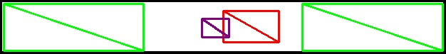

### 输入图片

### 轮廓提取结果

### 商标图片检测结果

  
### 商标文字检测结果

  
### 产品示意图检测结果

  
### 产品文字检测结果

  
  

### 每个面的信息融合结果
  
**其中，黄色部分对应产品相关的宣传语，蓝色对应产品，灰色对应商标图**
**绿色对应背景中非空白部分的艺术设计部分**

#### 面1的检测结果

#### 面2的检测结果

#### 面3的检测结果

### 动态展示效果
https://foreverruri.github.io/zihui_dynamic_display/
