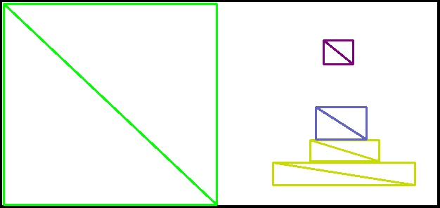

# 自会系统效果展示

## 输入图片示例

## Step 1 轮廓提取结果
&#8195;&#8195; 利用计算机视觉技术对输入包装的边缘轮廓进行提取，结果如下

## Step 2 对图中文字进行检测

* ### 检测结果

* ### 检测区域

* 对所有的检测结果进行修正和剪裁，用于后续操作和模型效果提升

* ### 检测结果置信度

|  字段   | 置信度  |
| ---- | ----  |
| **CHOCOLATE**  | 0.9883 |
| **DARK**  | 0.9997 |
| **8alst** | 0.4264 |

* ### 检测结果改正和验证
* 使用自然语言处理技术对输入置信度较低(低于0.5)的部分进行改正，得到`CHOCOLATE`, `DARK`, `Aalst`等三个字段。
* 对指示产品内容的`CHOCOLATE`和对应品牌的`Aalst`进行分类。
* **二者都属于`Food`类别，从而通过验证，确认当前输入是一食品包装，进行后续操作。**

## Step 3 对商标图片和产品示意图进行检测

* ### 检测结果

* 商标

* 产品

* ### 检测区域

* 商标

  
* 产品

&#8195;&#8195;若当前输入图片通过Step 2中的种类验证，则对其进行**对应类别**的检测，得到如下巧克力图像。

## Step 4 可见面的信息融合结果
  
**&#8195;&#8195;对三个可见面的检测结果进行信息融合**  

&#8195;&#8195;通过`自会`系统自研技术，进一步修正步骤2和3的检测结果，对所有检测结果所处区域和相对位置进行计算，得到每一个可见面的全部检测结果，使用颜色进行类别的区分。

**&#8195;&#8195;其中**
* 黄色部分对应产品相关的宣传语
* 蓝色对应产品图
* 紫色对应商标图
* 红色对应商标名称

**&#8195;&#8195;绿色对应背景中非空白部分的艺术设计部分**

**&#8195;&#8195;当前示例设计，会被存入数据库的`食品包装-六面体包装`子表下，并根据用户对其反馈实现`用户画像`，利用不同配置的子表实现特定需求的`准确推荐`。**

**&#8195;&#8195;借助设计领域的经验和积累，对商标图像和宣传语等不同类型所占区域的大小，相对位置进行调整，可得到不同效果的包装设计图，满足不同产品的设计需求，从而实现`创作智能`。**

* ### 面1的检测结果

* ### 面2的检测结果

* ### 面3的检测结果

## [3D动态展示效果](https://foreverruri.github.io/zihui_dynamic_display/)

